<p align="center">
  <picture>
    <source media="(prefers-color-scheme: dark)" srcset="docs/logo.svg">
    
  </picture>
</p>

# 🎹 KeyPulse

> Make any keyboard feel satisfying.

[](https://swift.org)
[](https://developer.apple.com/macos)
[](LICENSE)

A lightweight macOS menu bar app that plays low-latency mechanical keyboard sounds for every keystroke — no extra hardware, no noise in shared offices.

## ✨ Features

- ⚡ Real-time keystroke sounds with < 20ms latency
- 🔊 3 sound profiles: Linear, Tactile, Clicky
- 🎚️ Volume slider with mute toggle
- 🎲 Pitch randomization for natural feel
- 📱 Works system-wide in any app
- 🍎 Native menu bar UI, no Dock icon
- 💾 Settings persist across sessions
- 🚀 Launch at login

## 📦 Installation

### Build from Source

```bash
# Clone the repository
git clone https://github.com/jellydn/keypulse.git
cd keypulse

# Build release binary
just release

# Or build app bundle
just bundle
```

## 🚀 Usage

1. **Install** the app
2. **Launch** — you'll see the 🎹 icon in the menu bar
3. **Pick a profile** — Linear, Tactile, or Clicky
4. **Just type** — hear satisfying mechanical sounds with every keystroke

> ⚠️ **Accessibility Permission Required**: KeyPulse needs permission to monitor keyboard events. You'll be prompted on first launch — grant access in System Settings → Privacy & Security → Accessibility.

### Keyboard Shortcuts

| Shortcut    | Action                           |
| ----------- | -------------------------------- |
| `Cmd+,`     | Open Preferences                 |
| `Cmd+Opt+D` | Toggle Debug Window              |

## 🛠️ Development

```bash
# Install dependencies and build
just build

# Run tests
just test

# Run locally (requires accessibility permission)
just run

# Format code
just fmt

# Show all available commands
just
```

### Requirements

- macOS 13+
- Xcode 15+ / Swift 5.9+
- [just](https://github.com/casey/just) command runner

### Project Structure

```
KeyPulse/
├── Sources/KeyPulse/
│   ├── KeyPulse.swift                # App entry point
│   ├── KeyPulseAppDelegate.swift     # App lifecycle
│   ├── KeyPulseController.swift      # Main controller
│   ├── AudioEngine.swift             # Low-latency audio
│   ├── KeyboardMonitor.swift         # CGEventTap hook
│   ├── MenuBarManager.swift          # Menu bar UI
│   ├── SettingsStore.swift           # UserDefaults persistence
│   ├── SoundAssets.swift             # Sound profile definitions
│   ├── DebugWindowController.swift   # Debug window (SwiftUI)
│   ├── PreferencesWindowController.swift # Preferences window (SwiftUI)
│   └── DiagnosticsData.swift         # Diagnostics struct
├── Resources/Sounds/                 # WAV assets (linear/tactile/clicky)
└── Tests/KeyPulseTests/              # Unit tests
```

### Tech Stack

- **Platform**: macOS 13+, Swift 5.9+, SwiftPM
- **Audio**: `AVAudioEngine` + pre-loaded `AVAudioPCMBuffer`
- **Input**: `CGEventTap` (global keyboard hook)
- **Persistence**: `UserDefaults`
- **Build**: `just` command runner

### 🤖 Building with Ralph

This repo uses [Ralph](https://github.com/jellydn/ralph) — an autonomous agent loop that implements user stories from `scripts/ralph/prd.json`.

```bash
# Run one iteration
./scripts/ralph/ralph.sh --once

# Run loop until complete
./scripts/ralph/ralph.sh
```

### 🧪 TestFlight Distribution

See [docs/TESTFLIGHT.md](docs/TESTFLIGHT.md) for code signing, building release archives, and uploading to App Store Connect.

```bash
./scripts/build-release.sh 0.1.0 1
```

## 📋 Roadmap

| Feature                   | Status     |
| ------------------------- | ---------- |
| MVP with 3 sound profiles | ✅ Done    |
| Launch at login           | ✅ Done    |
| Pitch randomization       | ✅ Done    |
| Per-app profiles          | 🚧 Planned |
| Custom sound packs        | 🚧 Planned |
| Windows port              | 🔮 Future  |

## ⚠️ Known Issues

- Accessibility permission must be granted manually in System Settings
- Some apps with secure input fields may block keystroke detection

## 🤝 Contributing

Contributions are welcome! Please feel free to submit a Pull Request.

1. Fork the repository
2. Create your feature branch (`git checkout -b feature/amazing-feature`)
3. Commit your changes (`git commit -m 'feat: add amazing feature'`)
4. Push to the branch (`git push origin feature/amazing-feature`)
5. Open a Pull Request

## 👤 Author

**Huynh Duc Dung**

- Website: https://productsway.com
- Twitter: [@jellydn](https://twitter.com/jellydn)
- GitHub: [@jellydn](https://github.com/jellydn)

## ✨ Contributors

Contributions of any kind welcome!

## 🤲 Show your support

Give a ⭐️ if this project helped you! Support the developer with a donation:

[](https://ko-fi.com/jellydn)
[](https://www.paypal.me/jellydn)
[](https://www.buymeacoffee.com/jellydn)

## 📝 License

Copyright © 2025 [Huynh Duc Dung](https://github.com/jellydn).
This project is [MIT](LICENSE) licensed.

Sound assets are bundled under compatible licenses (CC0 or owner-licensed).

---

<p align="center">
  Made with ❤️ by <a href="https://github.com/jellydn">@jellydn</a>
</p>
